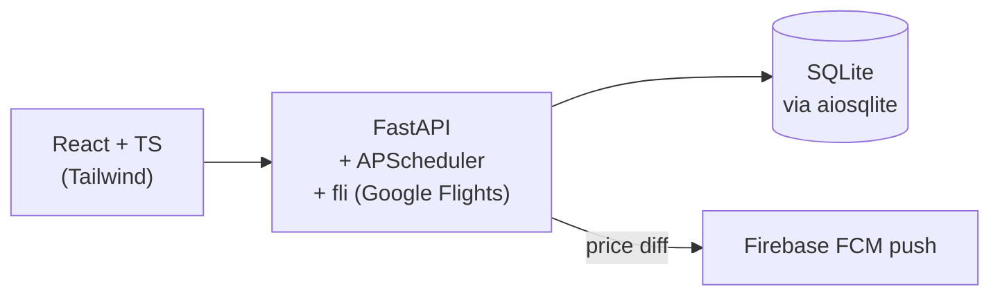

# Flight Tracker

Personal flight search and price-watch tool. Search routes, pin a flight, get a push when the price moves.

Live at [flights.rehde.rs](https://flights.rehde.rs).

## What it does

- Search by origin, destination, and date, with filters for stops, seat class, airlines, layover airports, and departure window.
- Pin a specific flight. The backend re-prices it on a schedule and sends a Firebase push (web or mobile web) when the price changes.
- Per-flight price history chart.
- 4-city explorer for [Mother's Ruin's Mother's Day Challenge](https://www.eventbrite.com/e/4th-annual-mothers-ruin-mothers-day-challenge-tickets-1982937256714), where you have to visit Mother's Ruin locations in 4 cities nationwide during opening hours on Mother's Day.

## Architecture



Caddy fronts both services so the frontend can call `/api` same-origin rather than spinning up a heavy NGINX server. Everything ships as three docker-compose containers.

## Stack

- Backend: Python 3, FastAPI, APScheduler, aiosqlite, Pydantic v2, firebase-admin, [fli](https://github.com/punitarani/fli) for Google Flights data.
- Frontend: React + TypeScript, Vite, Tailwind, Firebase web SDK.
- Infra: Docker Compose, Caddy.

## Design notes

- SQLite instead of Postgres. Single user, one writer process, fits on a small VPS. The schema is portable if that changes.
- In-process APScheduler instead of Celery/Redis. One polling loop, no fan-out, so a second service wouldn't buy anything.
- Polling dedupes by search config. Tracked flights sharing filters and date collapse into one upstream call, so N tracked flights doesn't mean N requests.
- fli instead of a paid API. It wraps Google Flights' internal endpoint (free, no key), with the tradeoff that I have to fix it if the contract shifts.

## Upstream contributions

Two improvements needed for this app that I ended up contributing to [fli](https://github.com/punitarani/fli) along the way:

- [#88 Basic economy filter](https://github.com/punitarani/fli/pull/88). Reverse-engineered the encoding via MITM proxy and added `exclude_basic_economy` to the model, CLI, and MCP server.
- [#99 More filters from a browser deep dive](https://github.com/punitarani/fli/pull/99). Added show-all-results and other filters; documented unknown payload positions via ~150 probing requests.

## The 4-city challenge

Mother's Ruin runs an annual challenge: visit 3/4/5 of their locations across the US within their opening hours on Mother's Day. Prize: a card for a free beer/cocktail a day, for life.

This year Charleston (CHS) is the required location due to being newly opened in 2026; participants pick three more from NYC, Nashville, Chicago, and Austin. The backend enumerates every ordered itinerary across those four cities for the travel date, prices each leg from live Google Flights data, and ranks routes by total cost and connection slack. A scheduled refresh keeps the cache warm so callers don't hit upstream on every page load.

Multiple filtering options exist in order to allow customization to personal preference:
- Variable MCT times to allow for risk tolerance
- Airline preference to turn the challenge into a mileage run📈
- Selection of number of locations depending how ambitious one is

The frontend re-applies these filters when the user change them, so the same cache works for everyone.

## Running locally

```
docker compose up --build
```

Requires `certs/firebase-service-account.json` for push notifications. In prod the file is materialized by the GitHub Actions deploy from the `FIREBASE_SERVICE_ACCOUNT_JSON` secret.
